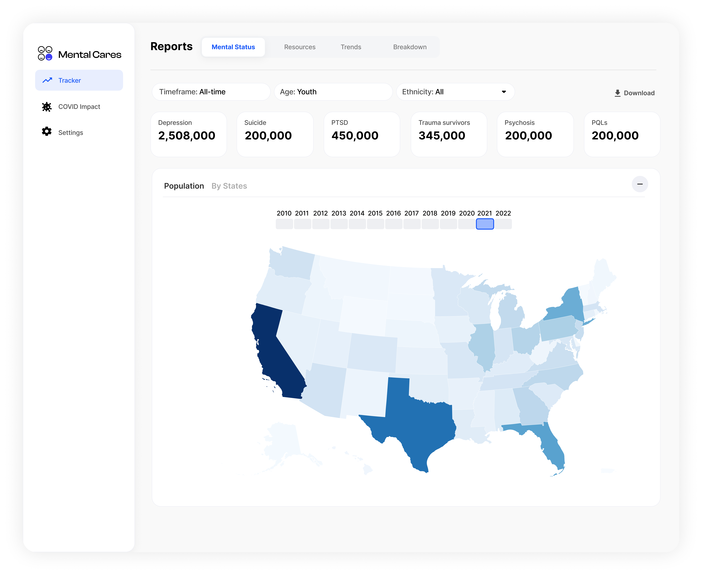

[](https://classroom.github.com/a/aIBftyMV)

# README
# Tracking Mental Health in the United States: Prevalance and Inequality 

Google Slide: [https://docs.google.com/presentation/d/1B6DT39wQXUN6wbZzVV8zCgrzVq5jIKIisujNVwgshFQ](https://docs.google.com/presentation/d/1B6DT39wQXUN6wbZzVV8zCgrzVq5jIKIisujNVwgshFQ)

## Data Source
- UNdata: [United Nations Development Programme](https://hdr.undp.org/data-center)
- [The World Bank](https://wbl.worldbank.org/)
- Country: ['Brazil','Canada','China','Germany','India','United States']

## Dashboard Design
The primary objective of this dashboard is to provide a comprehensive and user-friendly interface for tracking and analyzing ...

### Who are the users?
No previous knowledge about gender equality related indicators are required, as the dashboard is easily understood.
- Government policymakers and agencies
- Academic researchers and institutions
- Advocates and activists
- Media and journalists
- General public
- Audience with **vision deficiency**

### Indicators
- Gender Development Index (GDI)
- Gender Inequality Index (GII)
- Estimated gross national income per capita (2017 PPP $)
- Labour force participation rate (% ages 15 and older)
- Population with at least some secondary education (% ages 25 and older)
- Share of seats held by women in national parliaments (%)
- Maternal mortality ratio (Per 100,000 live birth)


### Data Encoding System

| Data   | Data Type   | Data Encoder |
| ----------- | ----------- | ----------- |
| Country | Norminal | HUE of Colors |
| Gender | Norminal | HUE of Colors |
| GDI | Ratio | Postion on Y-Axis | 
| GII | Ratio | Postion on X-Axis | 
| Estimated GNI Per Capita | Ratio | Width of Bars |
| Labor Force Participation Rate | Ratio | Postion on Y-Axis |

### Color Palette
- We used categorical color scale to distinguish countries, using `d3.schemeTableau10`
- We customized each element in the webpage using [./css/style.css](./css/style.css)
- For pyramid bar chart, I customized color as `['#e15759','#7bb1ea']`
- Considering audience with **vision deficiency**, I choose color schemes with different hue, saturation, and luminosity.

### Layout Design


### Final Demo


## Set Up and Deployment
### Development server
```
$ npm install bootstrap jquery popper.js d3 @types/d3 --save
$ npm run
```
### Build
```
$ ng build --
```
